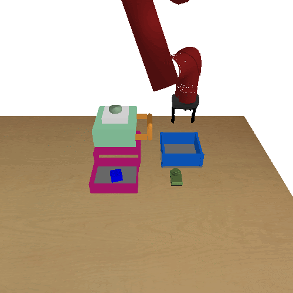
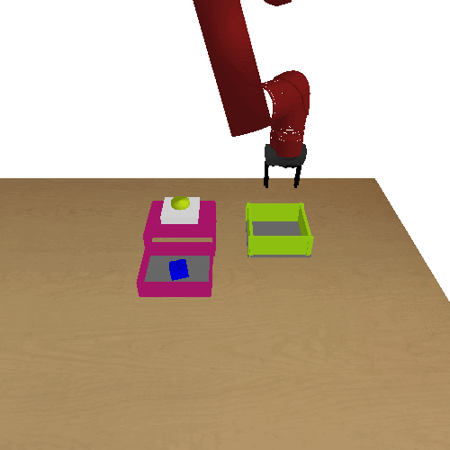
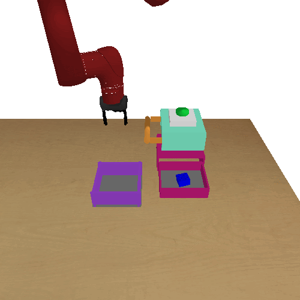
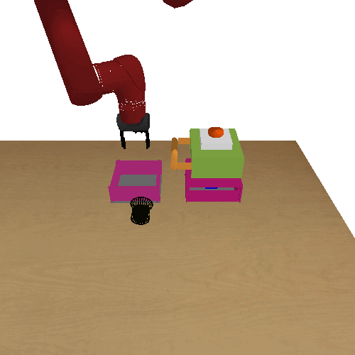
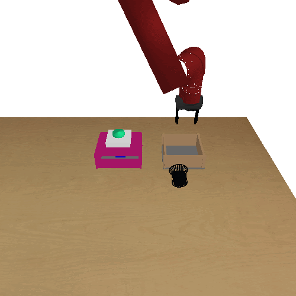
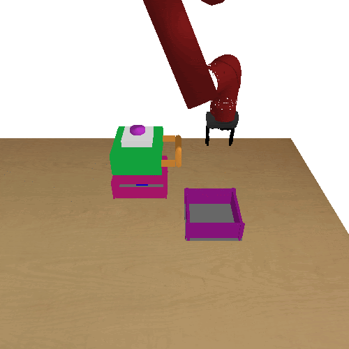

# bullet-manipulation

This repo contains PyBullet-based manipulation environments consisting of a Sawyer robot manipulating drawers and picking and placing objects.

|  |  |  |
|---|---|---|
|  |  |  |

These environments are featured in:

[What Can I Do Here? Learning New Skills by Imagining Visual Affordances](https://arxiv.org/abs/2106.00671)
Alexander Khazatsky*, Ashvin Nair*, Daniel Jing, Sergey Levine. International Conference on Robotics and Automation (ICRA), 2021.

[Offline Meta-Reinforcement Learning with Online Self-Supervision](https://arxiv.org/abs/2107.03974)
Vitchyr H. Pong, Ashvin Nair, Laura Smith, Catherine Huang, Sergey Levine. arXiv preprint, 2021.

This repository extends https://github.com/avisingh599/roboverse which was developed by Avi Singh, Albert Yu, Jonathan Yang, Michael Janner, Huihan Liu, and Gaoyue Zhou. If you want to use ShapeNet objects, please download it from that repository: https://github.com/avisingh599/roboverse/tree/master/roboverse/assets/bullet-objects

## Setup
`pip install -r requirements.txt`

## Quick start
The best way to get started is to run:

```
python scripts/collect_data.py --gui True
```

If you have a spacemouse, you can run the environments interactively with: 
```
python scripts/spacemouse_control.py
```

